# eBon Reader

eBon Reader is a desktop app for importing retail eBon receipts, categorizing line items, and viewing spending analytics.

## Supported shops & import method

| Shop | Status | How to get receipts                                                                                                               | Import format |
| --- | --- |-----------------------------------------------------------------------------------------------------------------------------------| --- |
| REWE | Supported | Bulk download from web login                                                                                                      | PDF |
| Lidl | Supported | Browser script from logged-in web account bulk to `.json` (copy script from settings), or copy/paste single eBon text into `.txt` | JSON / TXT |
| Kaufland | Supported | Download each eBon manually in the mobile app and send/share it to your computer                                                  | PDF |

Retailers expose receipts differently, so the import flow depends on what their platform allows.

## Bonus program semantics

- REWE usually uses cashback that is earned now and redeemed later.
- Lidl and Kaufland often use instant discounts applied directly at checkout.
- Direct cross-shop comparison is therefore imperfect.
- Category and item analytics use basket values.
- REWE cashback appears as an aggregated block at the bottom of the receipt, not under individual items, so it cannot be treated like item-adjacent instant discounts.
- Basket values currently reflect printed item totals, not always net cash outflow after all discounts or redemptions. This behavior may change as receipt support and comparison logic evolve.

## Features

- Import and parse receipt data from supported eBon/PDF/TXT/JSON formats across REWE, Lidl, and Kaufland
- Categorize purchases with configurable rules
- View spending statistics and category-based analytics
- Run as a desktop app via Tauri or in local backend/frontend development mode

## Installation / Getting Started

### 1) Use the prebuilt Windows app (`.exe`)

1. Open the repository's **Releases** page on GitHub.
2. Download the latest Windows `.exe` build.
3. Run the executable.

This is the quickest way to use the app without setting up Python or Node.js locally.

### 2) Run manually (Python backend + Svelte frontend)

Prerequisites:

- Python 3.11+
- Node.js 20+
- npm

Backend (FastAPI):

```bash
cd backend
python -m venv .venv
# Windows PowerShell:
.venv\Scripts\Activate.ps1
# macOS/Linux:
# source .venv/bin/activate
pip install -r requirements.txt
uvicorn main:app --reload --host 127.0.0.1 --port 8000
```

Frontend (Svelte 5 + Vite):

```bash
cd frontend
npm install
npm run dev
```

By default, frontend dev runs on `http://localhost:5173` and connects to backend on `http://127.0.0.1:8000`.

## Screenshots

### Overview

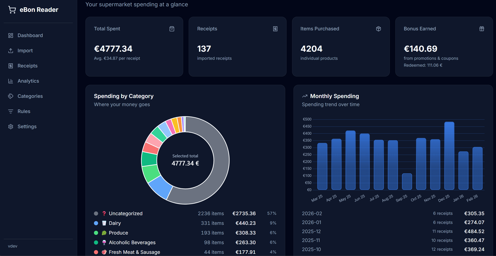
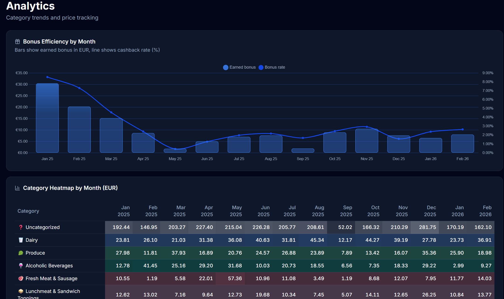
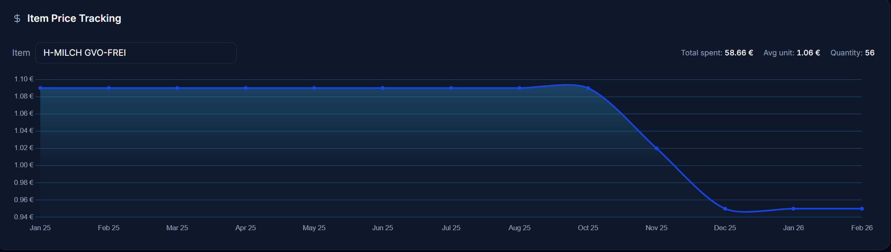

### Workflow: Ingestion Pipeline

1. 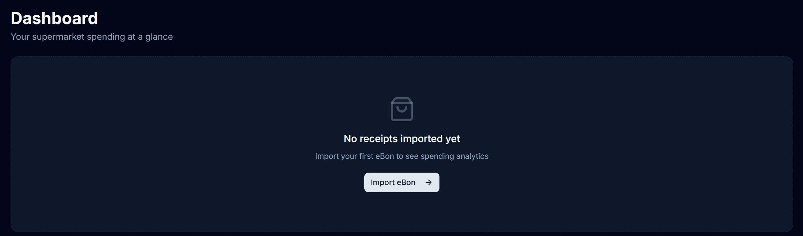
2a. 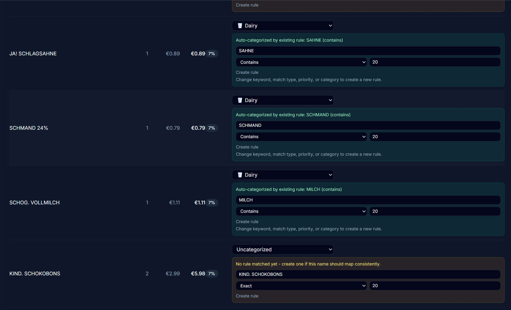
2b. 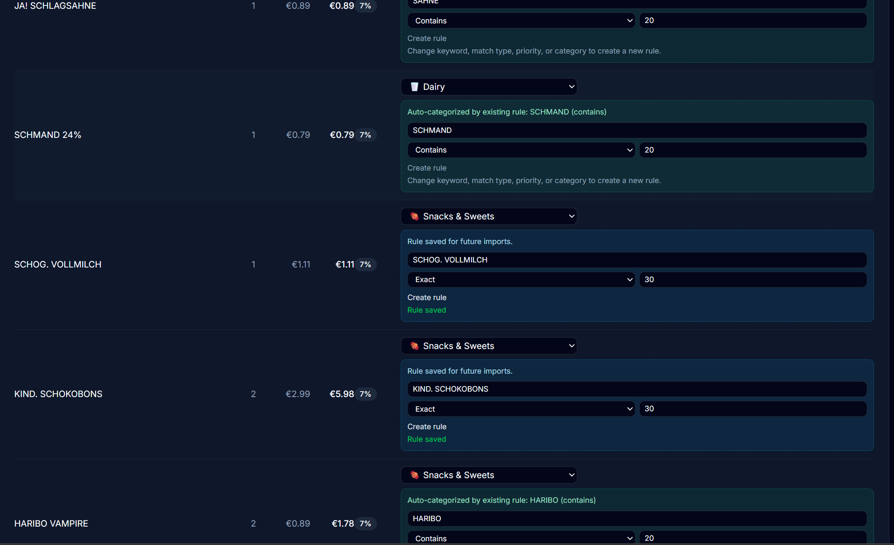
3. 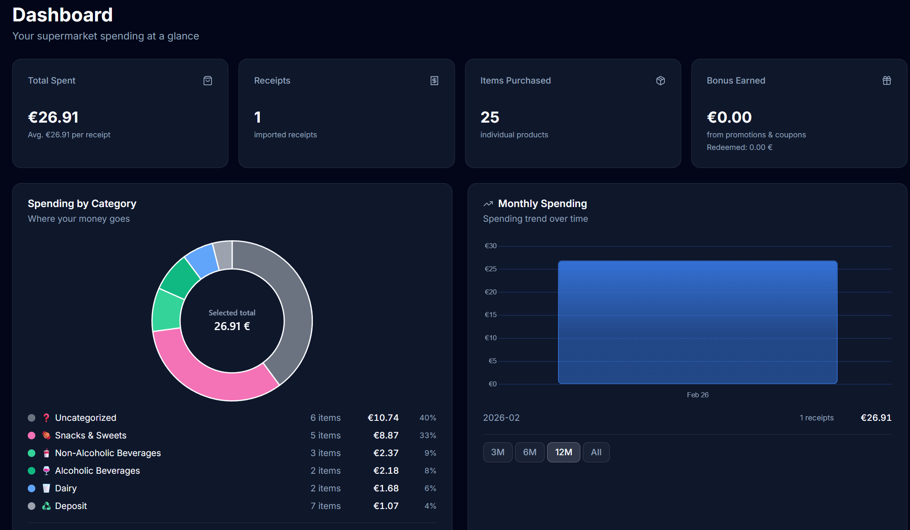
4. 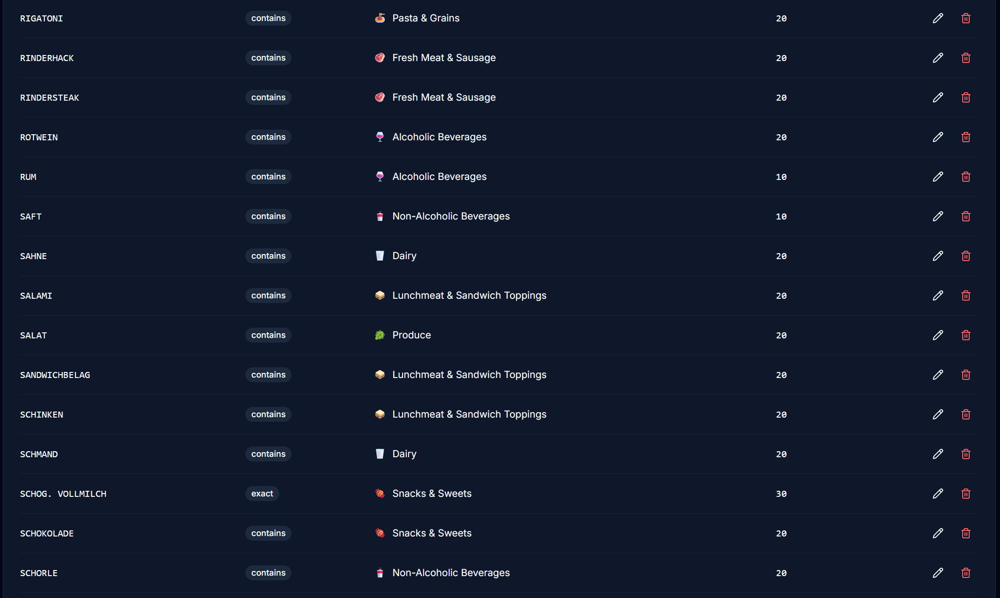
5. 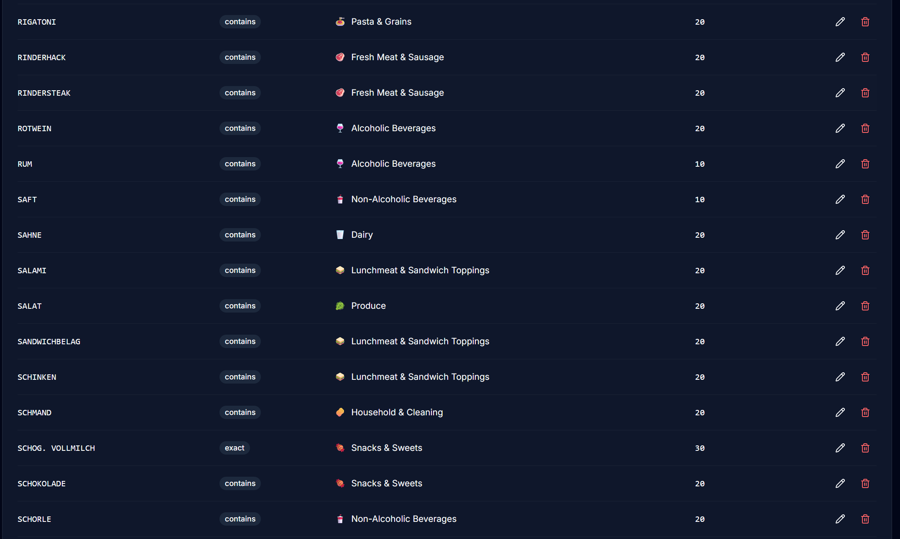
6. 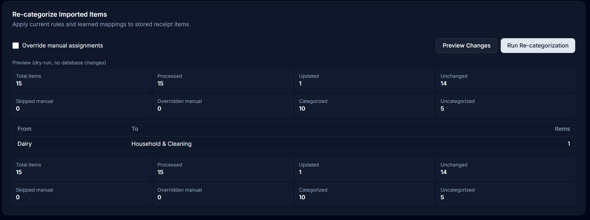
7. 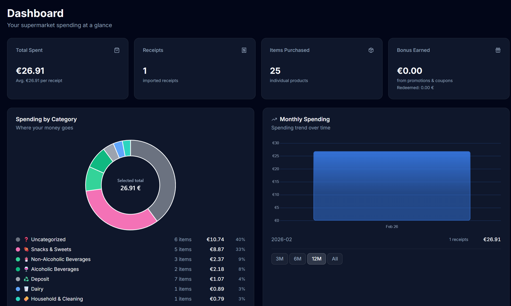
8. 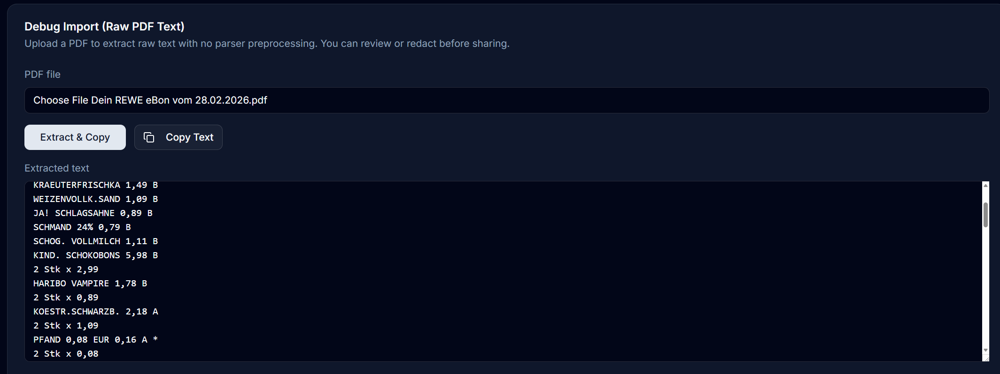

## Roadmap

- More statistics and richer analytics views
- More sophisticated ML-based categorization
- Support for more receipt templates and stores
- Localization (starting with German)

## Tech Stack

- FastAPI (backend API)
- SQLModel + SQLite (data layer)
- Svelte 5 (frontend)
- Tauri (desktop packaging/runtime)

## License

This project is intended to be licensed under Apache-2.0.
